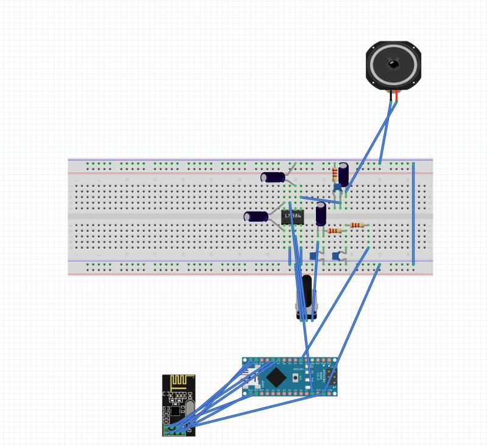
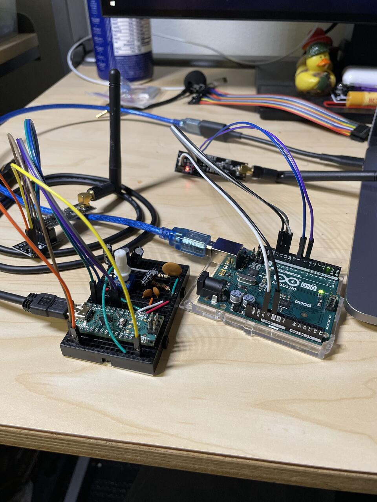
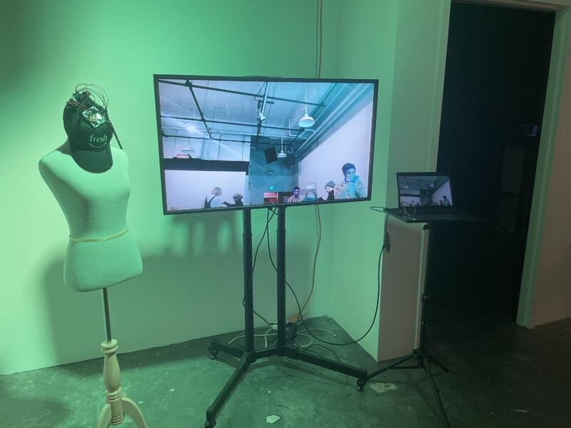

# Future Amazon Fresh Employee

Tasked with building a device from a potential future, I envisioned a world where our increasing online behavior resulted in all humans lacking the ability to understand facial expressions and emotions. 

Through the use of computer vision, I categorize the user's face expression and transmit that to a speaker on the hat which annouces their emotion.

## Images and Schematics

Above is the schematic for the hat including the audio amplifier and radio connections



Above is what the circuitry looks like upclose


Above is my project on display during our class symposium

## How to Run
Since there are two components to this projects, run the commands below for each portion.

### Arduino
Install the following packages through the Arduino IDE:
*   Talkie
*   RF24


Flash the ```TheEmotionizer3000.ino``` on to the hat and flash ```sendModule.ino``` on to the Arduino device tethered to the computer

### Python
Install the requiste packages with
    
    pip install requirements.txt

Plug your computer into arduino. This project uses serial communication between the arduino and your computer
    
    python recognition3.py 


